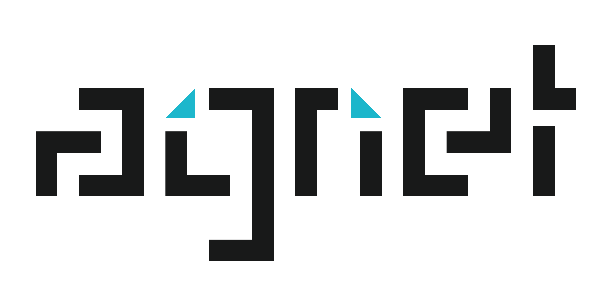

  <!-- Company Logo -->
  <picture>
    <source media="(prefers-color-scheme: dark)" srcset="assets/agnet-dark.svg" />
    <source media="(prefers-color-scheme: light)" srcset="assets/agnet-light.svg" />
    
  </picture>

<h2 align="center">AgnetLabs</h2>

  Powering the Future of Distributed Intelligence.

  
  
  

---

### 🧠 About AgnetLabs

Agnet Labs is an open innovation company building tools, frameworks, and infrastructure for multi-agent systems, AI collaboration, and intelligent automation — including Laddr, our flagship open-source framework.

Our mission is to make **distributed intelligence accessible, transparent, and massively scalable** for everyone.

---

### ⚙️ Laddr — The Open-Source Core

Laddr is an **open-source framework** for building and scaling multi-agent systems that communicate, delegate, and execute tasks in parallel — powered by a **queue-based delegation architecture**.

#### 🔹 Core Highlights

- 🧩 **Parallel Processing:** Multiple workers per agent for massive scalability
- 🪶 **Queue System:** Task delegation across distributed agents
- 📊 **Local Dashboard (Docker):** Visualize agents, tools, jobs, prompts, traces & token usage
- 🧠 **System & Agent-Level Prompting:** Coordinate or control specific agents
- 💾 **Trace & Artifact Storage:** PostgreSQL + MinIO/S3 integration
- 🔌 **API-First Design:** Access traces, jobs, and system health via REST APIs
- ⚙️ **Fully Configurable:** Modular and flexible at every layer

📘 [Explore the Docs →](https://laddr.agnetlabs.com)  
💻 [View on GitHub →](https://github.com/AgnetLabs/laddr)

---

### 💌 Newsletter

Stay in the loop as we continue to build the future of agentic systems.  
Get product updates, release notes, and insights directly from the team at AgnetLabs.

👉 [Subscribe to our Newsletter](https://agnetlabs.com)

---

<h2 align="center">💙 Connect With Us</h2>

  
  
  

---

  Made with 💙 by <a href="https://agnetlabs.com">AgnetLabs</a>

